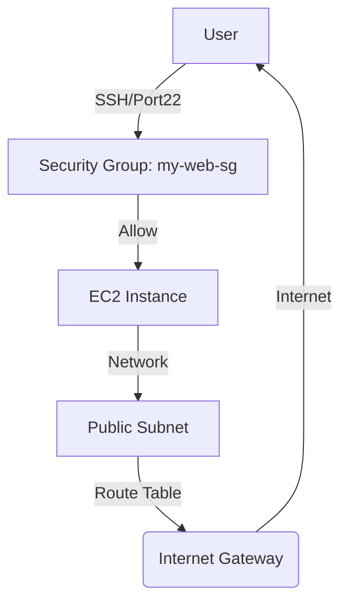

# AWS Networking Study

AWSのネットワーク基礎（VPC/Subnet/IGW/RouteTable）を構築し、インフラの構造を理解。

## 1. ネットワーク構成図

## 2. 構築ログ

### ステップ1：VPCの作成
- **CIDR:** 10.0.0.0/16
- **名前:** my-first-vpc
- **メモ:** 仮想ネットワークの土台を作成。

### ステップ2：パブリックサブネットの作成
- **CIDR:** 10.0.1.0/24
- **名前:** public-subnet-1
- **AZ:** ap-northeast-1a
- **メモ:** VPCを小分けにした区画。

### ステップ3：インターネットゲートウェイ (IGW) の作成
- **名前:** my-igw
- **状態:** Attached (my-first-vpcへアタッチ済み)
- **メモ:** これをVPCにアタッチしないと外と通信できない。

### ステップ4：ルートテーブルの設定
- **名前:** public-rt
- **設定内容:** 0.0.0.0/0 -> my-igw
- **サブネットの関連付け:** public-subnet-1
- **メモ:** サブネットからインターネットへの出口を定義。

### ステップ5：セキュリティグループ (Security Group) の作成
- **名前:** my-web-sg
- **インバウンドルール:** - **タイプ:** SSH (22)
  - **ソース:** マイIP (自分の接続環境のみ)
- **メモ:** サーバーを守る門番を配置。自分のIPからのみSSHを許可。

### ステップ6：EC2インスタンスの起動
- **名前:** my-web-server
- **OS:** Amazon Linux 2023
- **インスタンスタイプ:** t2.micro
- **セキュリティグループ:** my-web-sg を適用
- **メモ:** 作成したVPCネットワーク内に、実際に動く仮想サーバーを配置。

### ステップ7：SSHによるログイン
- **接続方法:** EC2 Instance Connect
- **実行コマンド:** cat /etc/os-release
- **メモ:** ブラウザ上のコンソールから安全にサーバー内部へアクセス。

### ステップ8：セキュリティの最適化
- **SSH (22):** 運用保守のため、自身のグローバルIPアドレスからのみ許可。
- **HTTP (80):** Webサービス公開のため、全インターネット (`0.0.0.0/0`) に対して開放。
- **考察:** 最小権限の原則（Least Privilege）に基づき、管理用ポートをマイIPに制限することで、不正アクセスのリスクを低減した。

### ステップ9：プロジェクトのクリーンアップ
- 課金防止およびセキュリティ管理のため、使用済みのEC2インスタンスおよびVPCネットワークをすべて削除。
- **削除対象:** EC2 (my-web-server), VPC (my-first-vpc), IGW, Route Table.

## 3. まとめ
- **クラウドの階層構造の理解:** VPC（土地）→ Subnet（区画）→ Security Group（門）→ EC2（家）という階層構造を実際に構築して理解できた。
- **トラブルシューティング能力:** SSH接続不可やBashのエスケープエラーなど、環境固有のトラブルに対してログや設定を見直して解決する経験ができた。
- **コスト・資産管理:** リソースの起動だけでなく、クリーンアップまで含めたライフサイクル管理を意識した。
